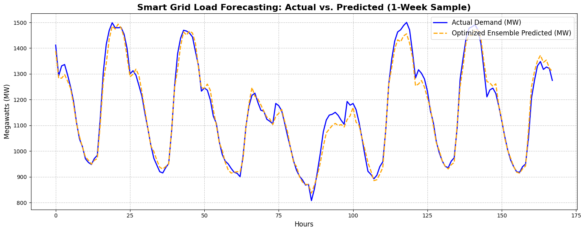

# Smart Grid Load Forecasting: Weighted Ensemble Architecture ⚡


## Overview
This repository contains a machine learning pipeline designed for short-term, day-ahead electricity load forecasting. Built using the Panama Short-Term Load Forecasting (STLF) dataset, the project processes multivariate time-series data (historical load, localized weather, and calendar events) to predict national energy demand. 

Accurate load forecasting is a critical component of modern Smart Grids, enabling efficient resource allocation, preventing grid instability, and optimizing Battery Energy Storage Systems (BESS).

## Visual Proof of Performance
Below is a one-week sample from the unseen test set, demonstrating the model's ability to track complex, non-linear diurnal consumption patterns.



## Architecture & Methodology
The project explores deep learning (LSTM) and gradient-boosted trees (XGBoost) before implementing a dynamic **Weighted Ensemble Optimization**.

1. **Data Preprocessing:** Handled missing sensor data via linear interpolation to maintain temporal integrity.
2. **Feature Engineering:** Extracted calendar features, generated 24-hour rolling means, and implemented lag features (`lag_1`) to capture autocorrelation. Scaled features uniformly using `MinMaxScaler`.
3. **Model Training:** Independently trained a multi-layer LSTM and an XGBoost regressor.
4. **Ensemble Optimization:** Deployed a grid-search algorithm to dynamically weight the outputs of both models. The optimizer concluded that a pure XGBoost architecture mathematically minimized the error for this specific tabular dataset.

## Key Results
The finalized model was evaluated on an unseen 20% test partition, yielding highly accurate baseline metrics:
* **Root Mean Square Error (RMSE):** 43.87 MW
* **Mean Absolute Percentage Error (MAPE):** 2.64%

## Tech Stack
* **Data Manipulation:** `pandas`, `numpy`
* **Machine Learning:** `scikit-learn`, `xgboost`, `tensorflow.keras`
* **Visualization:** `matplotlib`
* **Persistence:** `joblib` (Model and Scaler serialization)

## Project Structure
```text
├── data/
│   └── continuous_dataset.csv       # Raw STLF Data
├── saved_models/
│   ├── xgboost_forecasting_model.json # Serialized XGBoost Model
│   ├── scaler_X.pkl                 # Feature Scaler
│   └── scaler_y.pkl                 # Target Scaler
├── visualizations/
│   └── actual_vs_predicted.png      # Performance Graph
├── SmartGrid_Forecasting.ipynb      # Main Development Notebook
└── README.md
