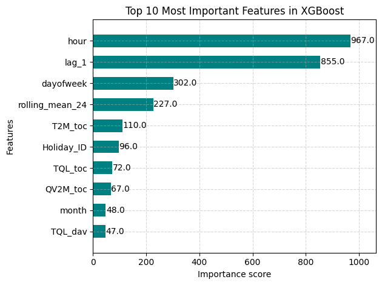
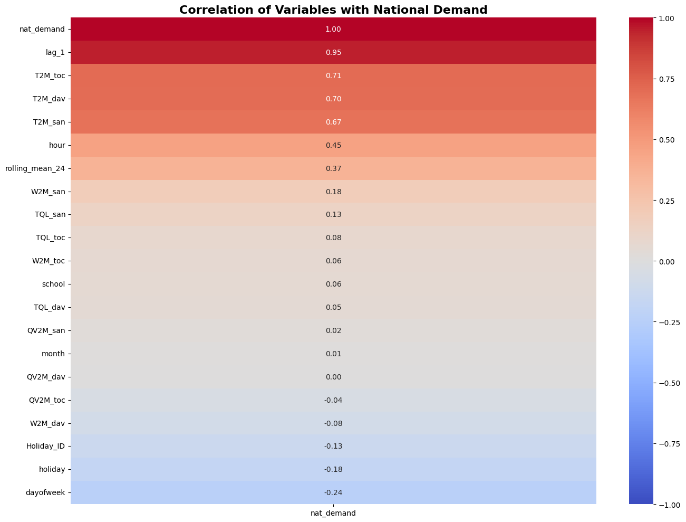

# ⚡ Smart Grid Load Forecasting: Weighted Ensemble Architecture


## Overview
This repository contains a production-ready machine learning pipeline designed for short-term, day-ahead electricity load forecasting. Built using the Panama Short-Term Load Forecasting (STLF) dataset, the project processes multivariate time-series data (historical load, localized weather, and calendar events) to predict national energy demand. 

Accurate load forecasting is a critical component of modern Smart Grids, enabling efficient resource allocation, preventing grid instability, and optimizing Battery Energy Storage Systems (BESS).

---

## 📊 Model Performance & Visual Proof
The finalized Weighted Ensemble (optimized to a pure XGBoost architecture for tabular efficiency) was evaluated on an unseen 20% test partition.

* **Root Mean Square Error (RMSE):** 43.87 MW
* **Mean Absolute Percentage Error (MAPE):** 2.64%

Below is a one-week sample from the test set, demonstrating the model's ability to precisely track complex, non-linear diurnal consumption patterns:


---

## 🧠 Explainable AI (XAI) & Data Insights
In smart grid operations, model interpretability is just as important as accuracy. 

### 1. Feature Importance
An analysis of the model's decision-making process reveals that our engineered temporal features (`lag_1` and `rolling_mean_24`) were the strongest predictors, followed closely by localized ambient temperature.



### 2. Exogenous Variable Correlation
Pearson correlation confirms grid economics: localized temperature (T2M) and relative humidity (QV2M) drive massive load spikes (HVAC usage), while public holidays suppress the base load.



---

## ⚙️ Architecture & Methodology
The project explores deep learning (LSTM) and gradient-boosted trees (XGBoost) before implementing a dynamic **Weighted Ensemble Optimization**.

1. **Data Engineering:** Handled missing sensor data via linear interpolation. Extracted calendar features, generated 24-hour rolling means, and implemented lag features. Scaled features uniformly using `MinMaxScaler`.
2. **Deep Learning Baseline:** Trained a multi-layer Sequential LSTM on 3D sequence tensors (24-hour lookback windows) to capture long-term temporal dependencies.
3. **Gradient Boosting Baseline:** Trained an XGBoost Regressor to handle non-linear tabular interactions.
4. **Ensemble Optimization:** Deployed a grid-search algorithm to dynamically weight the outputs of both models. The optimizer mathematically concluded that for this specific dataset structure, the XGBoost architecture minimized the validation error.

## 📁 Project Structure
```text
├── data/                            # Ignored in Git (Raw STLF Data)
├── saved_models/
│   ├── xgboost_forecasting_model.json # Serialized Model
│   ├── scaler_X.pkl                 # Feature Scaler
│   └── scaler_y.pkl                 # Target Scaler
├── visualizations/
│   ├── actual_vs_predicted.png      
│   ├── correlation_heatmap.png      
│   └── feature_importance.png       
├── SmartGrid_Forecasting.ipynb      # Main Development Notebook
├── requirements.txt                 # Dependencies
└── README.md
